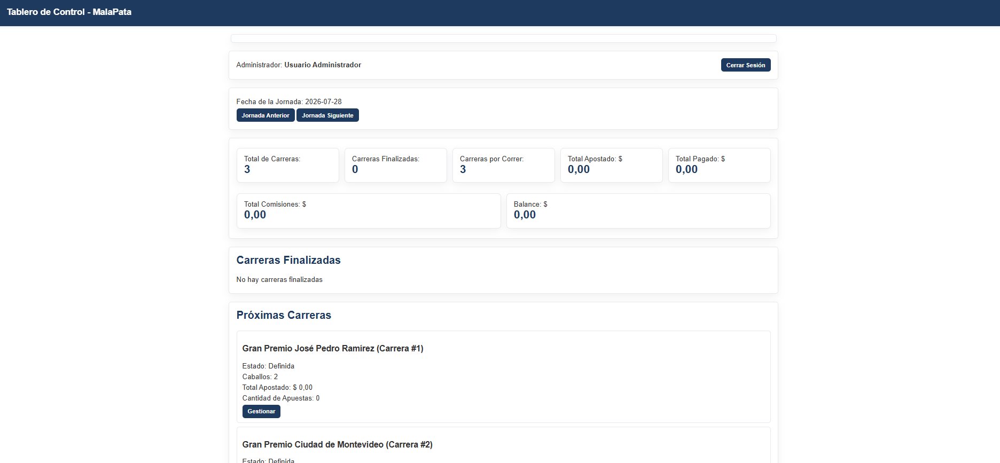
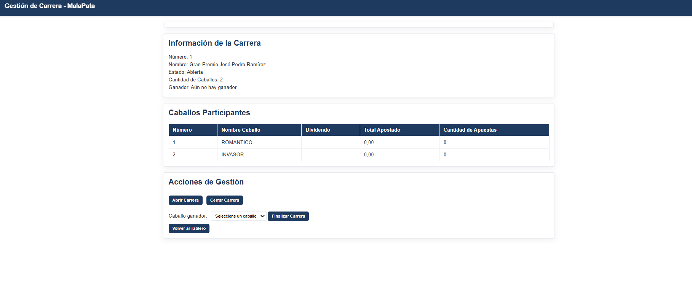
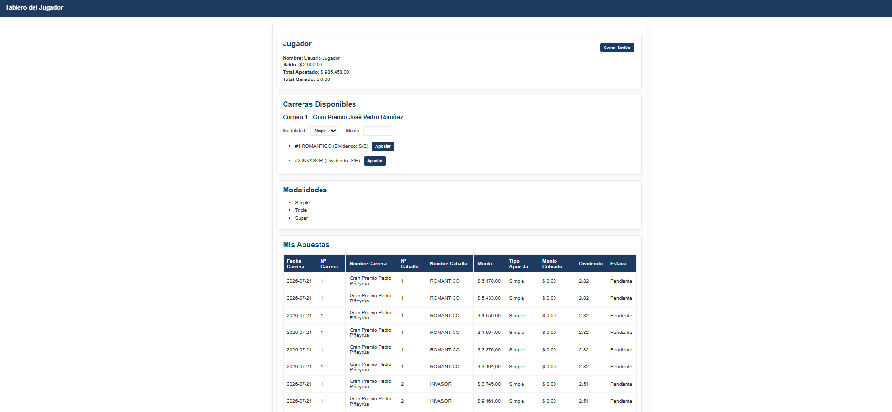
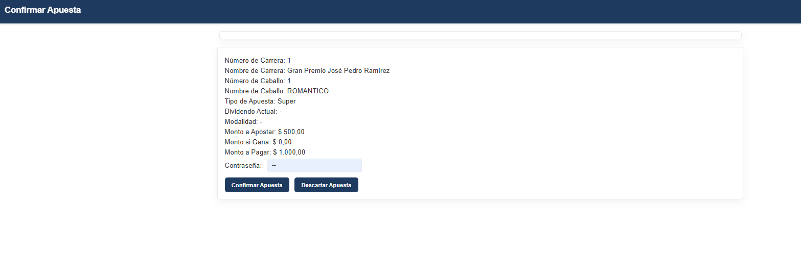

# Sistema de Apuestas para Hipódromo

Aplicación web para la gestión de un hipódromo: administración de carreras y jugadores, con un sistema de apuestas de múltiples modalidades y cálculo dinámico de dividendos en tiempo real.

Proyecto personal de desarrollo backend con Java y Spring Boot, aplicando patrones de diseño y arquitectura en capas.

---

## Tecnologías

**Backend:** Java 21 · Spring Boot 4.0.6 · Lombok · Jackson  
**Frontend:** HTML5 · CSS3 · JavaScript vanilla · Server-Sent Events (SSE)  
**Testing:** JUnit 5  
**Build:** Maven Wrapper

---

## Funcionalidades

- **Panel del Administrador** — Tablero de control con métricas en tiempo real, gestión del ciclo de vida de cada carrera (definida, abierta, estable, cerrada, finalizada) y liquidación de apuestas.
- **Panel del Jugador** — Consulta de carreras disponibles, realización de apuestas con tres modalidades distintas (Simple, Triple, Súper) y seguimiento del historial.
- **Cálculo dinámico de dividendos** — El dividendo de cada caballo se recalcula automáticamente con cada nueva apuesta, aplicando la comisión del hipódromo.
- **Actualización en tiempo real** — Las vistas se refrescan automáticamente con Server-Sent Events, sin necesidad de recargar la página.

---

## Arquitectura

El proyecto sigue una arquitectura **MVP (Modelo-Vista-Presentador)** con Server Driven UI.

Puntos técnicos destacados:

- **Polimorfismo** en las modalidades de apuesta (Simple, Triple, Súper) — cada una encapsula sus propias reglas de cálculo de costo y pago, permitiendo agregar nuevas modalidades sin modificar el código existente.
- **Patrón Observer** — cuando se registra una apuesta, se notifica a las participaciones para recalcular los dividendos del resto de los caballos de la carrera.
- **Separación en capas** — dominio, DTOs, presentadores, servicios y vistas están claramente aislados, cada uno con su responsabilidad.

---

## Screenshots

### Panel del Administrador




### Panel del Jugador




---

## Cómo ejecutarlo

**Requisitos:** Java 21 o superior.

```bash
# Clonar el repositorio
git clone https://github.com/brunodevcore/horse-racing-betting-system.git
cd horse-racing-betting-system

# Ejecutar (Linux / macOS)
./mvnw spring-boot:run

# Ejecutar (Windows)
mvnw.cmd spring-boot:run
```

Acceder desde el navegador:

- **Administrador:** [http://localhost:8080/vistas/loginAdmin.html](http://localhost:8080/vistas/loginAdmin.html)
- **Jugador:** [http://localhost:8080/vistas/loginJugador.html](http://localhost:8080/vistas/loginJugador.html)

**Credenciales de prueba precargadas:**

- Administrador — usuario: `a1` / contraseña: `a1`
- Jugador — usuario: `j1` / contraseña: `j1` (saldo inicial: 2000)

---

## Autor

**Bruno Rivero** — Desarrollador Backend Junior · Montevideo, Uruguay

- LinkedIn: [linkedin.com/in/brunorivero-dev](https://linkedin.com/in/brunorivero-dev)
- GitHub: [github.com/brunodevcore](https://github.com/brunodevcore)
- Email: bruno.erre@outlook.com
